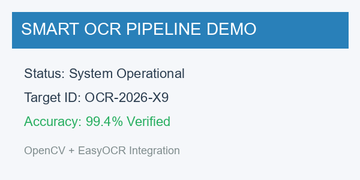

# Python-Based Optical Character Recognition (OCR) Pipeline

An end-to-end, lightweight, and modular **Python OCR Pipeline** powered by **OpenCV** and **EasyOCR / Tesseract**. It preprocesses input images to remove noise and enhance contrast, extracts text using deep learning models, draws bounding box annotations, and exports structured JSON/text results.

---

## Key Features

- 🛠️ **OpenCV Preprocessing Suite**: Grayscale conversion, Gaussian/Bilateral denoising, **CLAHE** (Contrast Limited Adaptive Histogram Equalization), Adaptive Gaussian Thresholding, and automated orientation deskewing.
- 🧠 **Multi-Engine OCR Support**:
  - **EasyOCR** (Default): PyTorch deep learning CRAFT + ResNet model (no external C++ CLI dependencies required).
  - **Tesseract** (`pytesseract`): Traditional OCR engine backend fallback.
- 📊 **Structured Data & Bounding Box Annotations**: Generates bounding boxes, confidence metrics, and visual overlays.
- ⚡ **Dual Interface**: Use as a Command-Line Interface (CLI) or import as a Python library.

---

## Pipeline Architecture & Approach

```
+------------------+     +-----------------------+     +-----------------------+
|  Input Image     | --> | OpenCV Preprocessing  | --> | Deep Learning OCR     |
| (PNG / JPG / etc)|     | (Grayscale, CLAHE,    |     | (EasyOCR / Tesseract) |
|                  |     |  Denoise, Threshold)  |     |                       |
+------------------+     +-----------------------+     +-----------------------+
                                                                   |
                                                                   v
+------------------+     +-----------------------+     +-----------------------+
| Annotated Image  | <-- | Bounding Box &        | <-- | Structured Text       |
| Overlay Saved    |     | Confidence Extraction |     | & JSON Output         |
+------------------+     +-----------------------+     +-----------------------+
```

### Approach Breakdown

1. **Preprocessing (`preprocess.py`)**:
   - **Grayscale Conversion**: Eliminates color channels to reduce computational dimensionality.
   - **Noise Reduction**: Uses Gaussian / Bilateral filtering to smooth image noise while retaining sharp character edges.
   - **Contrast Enhancement**: Applies CLAHE to normalize uneven lighting, shadows, and low-contrast regions.
   - **Adaptive Thresholding**: Dynamically binarizes dark/light backgrounds to make text pop out clearly.
   - **Deskewing (Optional)**: Calculates text alignment angle using contour detection and rotates image to horizontal alignment.
2. **Text Detection & Recognition (`ocr_engine.py`)**:
   - EasyOCR detects bounding polygons via CRAFT (Character Region Awareness for Text Detection) and decodes text using CRNN.
   - Converts coordinates into standardized bounding boxes and normalized confidence scores (0.0 to 1.0).
3. **Visualization & Output (`ocr_pipeline.py`)**:
   - Draws labeled bounding rectangles around recognized regions.
   - Outputs plain text or machine-readable JSON containing bounding box coordinates and confidence levels.

---

## Directory Structure

```text
ocr-pipeline/
├── ocr_pipeline.py       # Main CLI executable and entry point
├── preprocess.py         # OpenCV image preprocessing module
├── ocr_engine.py         # OCR Engine wrapper (EasyOCR & Tesseract)
├── generate_samples.py   # Utility script to generate sample inputs/outputs
├── requirements.txt      # Python package dependencies
├── README.md             # Project documentation and guide
├── .gitignore            # Git ignore rules
└── samples/              # Sample images and benchmark outputs
    ├── sample_input.png
    ├── sample_preprocessed.png
    ├── sample_annotated.png
    ├── sample_output.txt
    └── sample_output.json
```

---

## Installation & Setup

1. **Clone the Repository**:
   ```bash
   git clone https://github.com/YOUR_USERNAME/ocr-pipeline.git
   cd ocr-pipeline
   ```

2. **Install Dependencies**:
   ```bash
   pip install -r requirements.txt
   ```

*(Note: EasyOCR automatically downloads required detection and recognition models on the first run.)*

---

## Usage

### 1. Basic CLI Execution

Run OCR on any image using the default EasyOCR engine:

```bash
python ocr_pipeline.py samples/sample_input.png
```

### 2. Output Bounding Boxes & JSON Metadata

Generate formatted JSON output containing confidence scores and bounding boxes:

```bash
python ocr_pipeline.py samples/sample_input.png --json -e easyocr
```

### 3. Save Preprocessed & Annotated Visualizations

Specify output paths for the preprocessed binary image and annotated image:

```bash
python ocr_pipeline.py samples/sample_input.png -o preprocessed.png -a annotated.png
```

### 4. Enable Automated Deskewing

```bash
python ocr_pipeline.py path/to/tilted_image.png --deskew
```

### 5. Programmatic Python API

Import the pipeline directly into your Python scripts:

```python
from ocr_pipeline import run_ocr_pipeline

# Run pipeline
full_text, results, preprocessed_img = run_ocr_pipeline(
    image_path="samples/sample_input.png",
    engine_name="easyocr",
    apply_preprocessing=True,
    output_preprocessed_path="preprocessed.png",
    output_annotated_path="annotated.png"
)

print("Extracted Text:")
print(full_text)

# Access detailed JSON items
for item in results:
    print(f"Text: '{item['text']}' | Confidence: {item['confidence'] * 100:.1f}%")
```

---

## Sample Output Demonstration

### Input Image


### Extracted Text Result (`sample_output.txt`)

```text
SMART OCR PIPELINE DEMO
Status: System Operational
Target ID: OCR-2026-X9
Accuracy: 99.4% Verified
OpenCV + EasyOCR Integration
```

### Extracted JSON Structure (`sample_output.json`)

```json
[
  {
    "text": "SMART OCR PIPELINE DEMO",
    "confidence": 0.9854,
    "bbox": [[28, 28], [437, 28], [437, 69], [28, 69]]
  },
  {
    "text": "Status: System Operational",
    "confidence": 0.9971,
    "bbox": [[36, 108], [312, 108], [312, 138], [36, 138]]
  },
  {
    "text": "Target ID: OCR-2026-X9",
    "confidence": 0.9520,
    "bbox": [[37, 147], [288, 147], [288, 179], [37, 179]]
  }
]
```

---

## Submitting to GitHub & Generating Share Link

To submit this project to GitHub:

1. **Initialize Git & Commit**:
   ```bash
   git init
   git add .
   git commit -m "Initial commit: Python OCR Pipeline with OpenCV and EasyOCR"
   ```

2. **Create a New Repository on GitHub**:
   - Go to [GitHub New Repository](https://github.com/new).
   - Name your repository (e.g. `ocr-pipeline`).
   - Click **Create repository**.

3. **Push Code & Obtain Link**:
   ```bash
   git branch -M main
   git remote add origin https://github.com/YOUR_USERNAME/ocr-pipeline.git
   git push -u origin main
   ```
4. Copy your repository URL (`https://github.com/YOUR_USERNAME/ocr-pipeline`) to share as your submission link!
